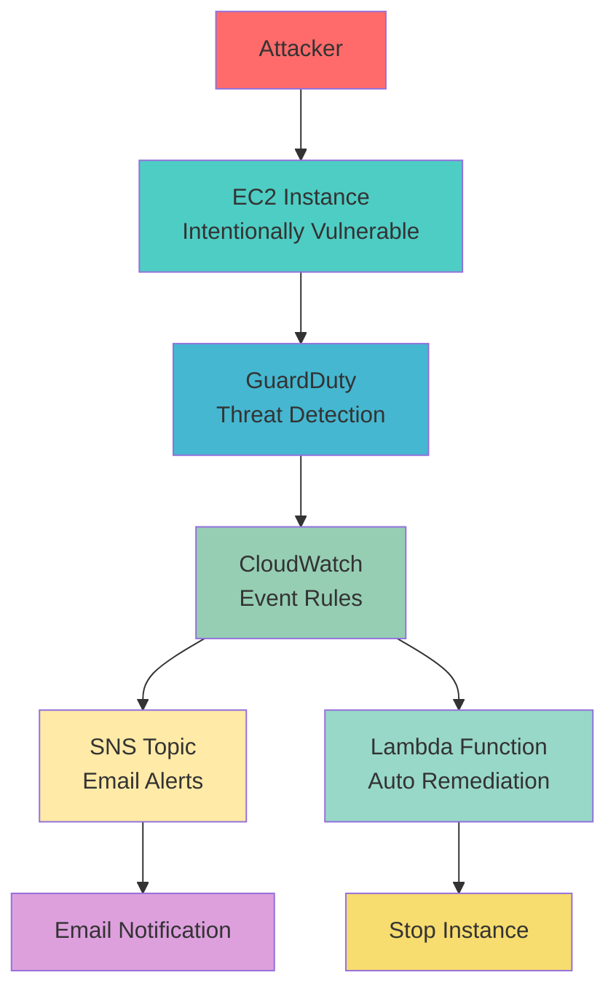

# Cloud Threat Detection & Incident Response Lab

[](https://aws.amazon.com/)
[](https://terraform.io/)
[](https://aws.amazon.com/guardduty/)

A hands-on lab demonstrating AWS GuardDuty, CloudWatch, and SNS for automated threat detection and incident response.

This project simulates a real-world security incident scenario where a misconfigured EC2 instance is attacked, triggering an automated detection and alert workflow using AWS security services.

## Why This Project Matters

- **Real-world relevance**: Mirrors actual SOC and cloud security automation tasks
- **Job-ready skills**: Demonstrates threat detection, not just infrastructure building
- **Security mindset**: Teaches you to think like an engineer who protects systems
- **Industry standard**: Uses tools and patterns employed by cloud security engineers and DevSecOps teams

## Architecture Overview



### Components

- **Target EC2 Instance**: Intentionally misconfigured with open SSH port and weak credentials
- **GuardDuty Detector**: Monitors for suspicious activity and generates findings
- **CloudWatch Event Rules**: Captures GuardDuty findings and triggers responses
- **SNS Topic**: Sends email alerts when security findings are detected
- **Lambda Function** (Optional): Automatically stops instances on high-severity threats

## Quick Start

### Prerequisites

- AWS account with CLI configured
- Terraform >= 1.5 installed
- Verified email address for SNS alerts
- SSH key pair for EC2 access

### 1. Clone and Setup

```bash
git clone https://github.com/yourusername/cloud-threat-detection-lab.git
cd cloud-threat-detection-lab
```

### 2. Configure Variables

```bash
cd infra
cp terraform.tfvars.example terraform.tfvars
# Edit terraform.tfvars with your values
```

Required variables:
```hcl
aws_region = "us-east-1"
ssh_public_key = "ssh-rsa AAAAB3NzaC1yc2EAAAADAQABAAACAQC... your-public-key"
alert_email = "your-email@example.com"
enable_auto_remediation = false  # Set to true for auto-stopping instances
```

### 3. Deploy Infrastructure

```bash
# Using the deployment script
../scripts/deploy.sh -i -a

# Or manually with Terraform
terraform init
terraform apply -auto-approve
```

### 4. Confirm Email Subscription

Check your email and confirm the SNS subscription to receive alerts.

### 5. Test the Setup

Wait 5-10 minutes for GuardDuty to initialize, then run:

```bash
# Get the target IP from Terraform output
terraform output instance_public_ip

# Run threat simulation
../scripts/test_threats.sh <target-ip>
```

## Testing Scenarios

The lab includes several testing scenarios:

### 1. Port Scanning
```bash
./scripts/test_threats.sh <target-ip> -t portscan
```
Simulates reconnaissance activities that GuardDuty detects as port scanning.

### 2. SSH Brute Force
```bash
./scripts/test_threats.sh <target-ip> -t ssh-brute
```
Attempts multiple SSH login attempts with common credentials.

### 3. Comprehensive Attack Simulation
```bash
./scripts/test_threats.sh <target-ip>
```
Runs all attack vectors to trigger multiple GuardDuty findings.

## Expected Results

After running the tests, you should see:

1. **GuardDuty Findings** (5-15 minutes):
   - `Recon:EC2/PortProbeUnprotectedPort`
   - `UnauthorizedAPICall:EC2/SSHBruteForce`
   - `Recon:EC2/Portscan`

2. **Email Alerts** via SNS:
   ```
   AWS GuardDuty Security Alert
   
   Finding ID: 12345678901234567890123456789012
   Type: Recon:EC2/PortProbeUnprotectedPort
   Severity: 4.0
   Title: Unprotected port 22 on i-1234567890abcdef0 is being probed
   ...
   ```

3. **Auto-Remediation** (if enabled):
   - High-severity findings trigger Lambda function
   - Instance automatically stopped
   - CloudWatch metrics recorded

## Project Structure

```
cloud-threat-detection-lab/
├── infra/                          # Terraform infrastructure
│   ├── main.tf                     # Main infrastructure definition
│   ├── variables.tf                # Variable definitions
│   ├── outputs.tf                  # Output values
│   ├── user_data.sh               # EC2 initialization script
│   ├── terraform.tfvars.example   # Example variables file
│   ├── lambda/                    # Lambda function code
│   │   └── index.py              # Auto-remediation function
│   ├── lambda_function.zip        # Packaged Lambda function
│   └── package_lambda.sh         # Lambda packaging script
├── scripts/                       # Utility scripts
│   ├── deploy.sh                 # Deployment automation
│   └── test_threats.sh          # Threat simulation script
└── README.md                     # This file
```

## Configuration Options

### Terraform Variables

| Variable | Description | Default | Required |
|----------|-------------|---------|----------|
| `aws_region` | AWS region for resources | `us-east-1` | No |
| `instance_type` | EC2 instance type | `t3.micro` | No |
| `ssh_public_key` | SSH public key for EC2 access | - | Yes |
| `alert_email` | Email for security alerts | - | Yes |
| `enable_auto_remediation` | Enable Lambda auto-remediation | `false` | No |

### Threat Types

The testing script supports various threat simulation types:

- `portscan`: Network reconnaissance
- `ssh-brute`: SSH brute force attacks
- `http`: HTTP enumeration
- `suspicious`: General suspicious activity
- `all`: All attack vectors (default)

## Security Considerations

**Important Security Notes:**

- This lab creates intentionally vulnerable resources
- Only deploy in isolated AWS accounts or lab environments
- The target instance has open SSH access and weak credentials
- Always destroy infrastructure after testing
- Never use these configurations in production

## Cleanup

To destroy all infrastructure:

```bash
cd infra
terraform destroy -auto-approve
```

Or use the deployment script:

```bash
./scripts/deploy.sh -d
```

## Learning Outcomes

After completing this lab, you'll understand:

- **GuardDuty Configuration**: How to set up and configure AWS GuardDuty
- **Event-Driven Architecture**: Using CloudWatch Events for security automation
- **Alert Pipelines**: Building notification systems with SNS
- **Auto-Remediation**: Implementing automated response to security incidents
- **Threat Simulation**: Testing security controls in controlled environments
- **Infrastructure as Code**: Managing security infrastructure with Terraform

## Next Steps

Extend this lab with:

1. **Security Hub Integration**: Forward findings to AWS Security Hub
2. **Slack Notifications**: Add Slack webhook for team alerts
3. **Enhanced Remediation**: More sophisticated response actions
4. **Log Analysis**: Store and analyze security logs in S3/Elasticsearch
5. **Compliance Reporting**: Generate compliance reports from findings

## Additional Resources

- [AWS GuardDuty Documentation](https://docs.aws.amazon.com/guardduty/)
- [CloudWatch Events Documentation](https://docs.aws.amazon.com/eventbridge/)
- [SNS Documentation](https://docs.aws.amazon.com/sns/)
- [Lambda Documentation](https://docs.aws.amazon.com/lambda/)

## Contributing

Contributions are welcome! Please feel free to submit a Pull Request.

## License

This project is licensed under the MIT License - see the [LICENSE](LICENSE) file for details.

## Disclaimer

This project is for educational and testing purposes only. The configurations used are intentionally vulnerable and should never be deployed in production environments. Users are responsible for ensuring compliance with their organization's security policies and applicable laws and regulations.

---

**Happy Learning!**

*Built with for the cloud security community*