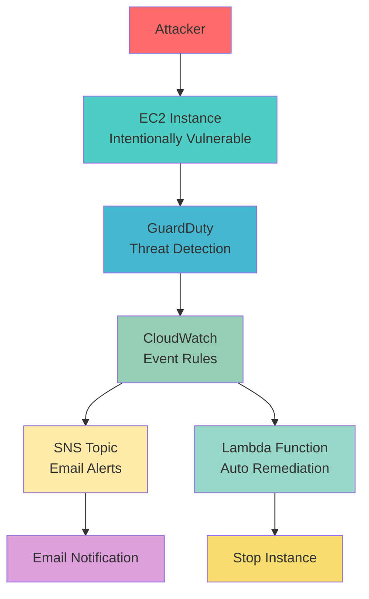

# Cloud Threat Detection & Incident Response Lab

[](https://aws.amazon.com/)
[](https://terraform.io/)
[](https://aws.amazon.com/guardduty/)

A hands-on lab simulating a real-world AWS security incident — misconfigured EC2 attacked, GuardDuty detects it, CloudWatch triggers automated alerting and optional Lambda remediation, all provisioned with Terraform.

## Architecture Overview


```mermaid
flowchart TD
    Attacker[Attacker] --> EC2[EC2 Instance<br/>Intentionally Vulnerable]
    EC2 --> GD[GuardDuty<br/>Threat Detection]
    GD --> CW[CloudWatch<br/>Event Rules]
    CW --> SNS[SNS Topic<br/>Email Alerts]
    SNS --> Email[Email Notification]
    CW --> Lambda[Lambda Function<br/>Auto Remediation]
    Lambda --> EC2_Stop[Stop Instance]
    
    style Attacker fill:#ff6b6b
    style EC2 fill:#4ecdc4
    style GD fill:#45b7d1
    style CW fill:#96ceb4
    style SNS fill:#ffeaa7
    style Email fill:#dda0dd
    style Lambda fill:#98d8c8
    style EC2_Stop fill:#f7dc6f
```

### Components

- **Target EC2 Instance**: Intentionally misconfigured with open SSH port and weak credentials
- **GuardDuty Detector**: Monitors for suspicious activity and generates findings
- **CloudWatch Event Rules**: Captures GuardDuty findings and triggers responses
- **SNS Topic**: Sends email alerts when security findings are detected
- **Lambda Function** (Optional): Automatically stops instances on high-severity threats

## Quick Start

### Prerequisites

- AWS account with CLI configured
- Terraform >= 1.5 installed
- Verified email address for SNS alerts
- SSH key pair for EC2 access

### 1. Clone and Setup

```bash
git clone https://github.com/pantelovich/cloud-threat-detection-lab.git
cd cloud-threat-detection-lab
```

### 2. Configure Variables

```bash
cd infra
cp terraform.tfvars.example terraform.tfvars
```

Required variables:
```hcl
aws_region              = "us-east-1"
ssh_public_key          = "ssh-rsa AAAAB3NzaC1yc2EAAAADAQABAAACAQC... your-public-key"
alert_email             = "your-email@example.com"
enable_auto_remediation = false  # Set to true for auto-stopping instances
```

### 3. Deploy Infrastructure

```bash
# Using the deployment script
../scripts/deploy.sh -i -a

# Or manually
terraform init
terraform apply -auto-approve
```

### 4. Confirm Email Subscription

Check your email and confirm the SNS subscription to receive alerts.

### 5. Test the Setup

Wait 5-10 minutes for GuardDuty to initialize, then run:

```bash
terraform output instance_public_ip
../scripts/test_threats.sh <target-ip>
```

## Testing Scenarios

### Port Scanning
```bash
./scripts/test_threats.sh <target-ip> -t portscan
```

### SSH Brute Force
```bash
./scripts/test_threats.sh <target-ip> -t ssh-brute
```

### Comprehensive Attack Simulation
```bash
./scripts/test_threats.sh <target-ip>
```

## Expected Results

1. **GuardDuty Findings** (5-15 minutes):
   - `Recon:EC2/PortProbeUnprotectedPort`
   - `UnauthorizedAPICall:EC2/SSHBruteForce`
   - `Recon:EC2/Portscan`

2. **Email Alerts** via SNS with finding ID, type, severity, and affected resource

3. **Auto-Remediation** (if enabled): high-severity findings trigger Lambda, instance stops automatically

## Project Structure

```
cloud-threat-detection-lab/
├── infra/
│   ├── main.tf
│   ├── variables.tf
│   ├── outputs.tf
│   ├── user_data.sh
│   ├── terraform.tfvars.example
│   ├── lambda/
│   │   └── index.py
│   ├── lambda_function.zip
│   └── package_lambda.sh
├── scripts/
│   ├── deploy.sh
│   └── test_threats.sh
└── README.md
```

## Terraform Variables

| Variable | Description | Default | Required |
|----------|-------------|---------|----------|
| `aws_region` | AWS region | `us-east-1` | No |
| `instance_type` | EC2 instance type | `t3.micro` | No |
| `ssh_public_key` | SSH public key for EC2 access | - | Yes |
| `alert_email` | Email for alerts | - | Yes |
| `enable_auto_remediation` | Enable Lambda auto-remediation | `false` | No |

## Security Considerations

- Only deploy in isolated AWS accounts or lab environments
- The target instance has open SSH access and weak credentials by design
- Always destroy infrastructure after testing — never leave this running

## Cleanup

```bash
cd infra && terraform destroy -auto-approve
```

## Next Steps

- Security Hub integration for centralised findings
- Slack webhook alerts
- Quarantine VPC isolation instead of stopping instances
- S3/Elasticsearch log storage and analysis

## License

MIT — see [LICENSE](LICENSE) for details.
